## mcnCrossModalEmotions

This module contains code in support of the paper [Emotion Recognition in Speech using Cross-Modal Transfer in the Wild](http://www.robots.ox.ac.uk/~vgg/research/cross-modal-emotions). The experiments are implemented using the [MatConvNet](https://github.com/vlfeat/matconvnet) framework.

PyTorch versions of the vision models are available [here](http://www.robots.ox.ac.uk/~albanie/pytorch-models.html#cross-modal-emotion).

### Installation

The easiest way to use this module is to install it with the `vl_contrib` package manager. `mcnCrossModalEmotions` can be installed with the following commands from the root directory of your MatConvNet installation:

```
vl_contrib('install', 'mcnCrossModalEmotions') ;
vl_contrib('setup', 'mcnCrossModalEmotions') ;
```

### Dependencies

mcnCrossModalEmotions requires a working [MatConvNet](https://github.com/vlfeat/matconvnet) installation, and the following modules (which will be downloaded automatically):

* [mcnDatasets](https://github.com/albanie/mcnDatasets) - dataset helpers for MatConvNet
* [mcnExtraLayers](https://github.com/albanie/mcnExtraLayers) - extra layers for MatConvNet
* [autonn](https://github.com/vlfeat/autonn) - autodiff for MatConvNet
* [VGGVox](https://github.com/a-nagrani/VGGVox) - VGGVox models for Speaker Identification and Verification trained on the VoxCeleb (1 & 2) datasets

Some of the scripts for analysis require [vlfeat](http://www.vlfeat.org/) (although this is not required for training).
### Overview

The [project page](http://www.robots.ox.ac.uk/~vgg/research/cross-modal-emotions/) has a high level overview of the work.

### Teacher Training

**Usage**: To use the teacher code, running [exps/bencmark\_ferplus\_models.m](exps/benchmark_ferplus_models.m) will download the pretrained teacher models and data and launch an evaluation function.  New teacher models can be trained with the [exps/ferplus\_baselines.m](exps/ferplus_baselines.m) function.


The following pretrained teacher CNNs are available:


| model | pretraining | training | Fer2013+ Val | Fer2013+ Test |
|-------|-------------|----------|--------------|---------------|
| resnet50-ferplus | [VGGFace2](https://arxiv.org/abs/1710.08092) | [Fer2013+](https://github.com/Microsoft/FERPlus) | 89.0 | 87.6 |
| senet50-ferplus | [VGGFace2](https://arxiv.org/abs/1710.08092) | [Fer2013+](https://github.com/Microsoft/FERPlus) | 89.8 | 88.8 |

More details relating to the models can be found [here](http://www.robots.ox.ac.uk/~albanie/mcn-models.html#cross-modal-emotion).

### Distillation

In the paper, we show that there is sufficient signal to learn emotion-predictive embeddings in the student, but that it is a very noisy task.  We validate that the student has learned something useful by testing it on external datasets for speech emotion recognition and showing that it can do quite a lot better than random, but as one would expect, not as well as a model trained with speech labels (Table 5 in the paper).

The distillation experiment can be re-run using the [run\_distillation.m](emoVoxCeleb/run_distillation.m) script.

By treating the dominant prediction of the teacher as kind of ground-truth one-hot label, we can also assess whether the student is to match some portion of the teacher's predictive signal. It's worth noting that since we are using interview data to perform the distillation (because this is what VoxCeleb consists of), emotions such as neutral and happiness are better represented in the videos.   For each emotion below, we first show the ROC curve for the student on the training set, followed by predictions on the test set of "heard" identities in the second column, then "unheard" identities in the third column. 

The idea here is that by looking at the performance on previously heard/unheard identities we can get some idea as to whether it is trying to solve the task by "cheating".  In this case, cheating would correspond to exploiting some bias in the dataset by memorising the identity of the speaker, rather than listening to the emotional content of their speech.  

We find that the student is able to learn a weak classifier for the dominant emotion predicted by the teacher, hinting that there may be a small redundant signal between the (human annotated) facial emotion of a speaker and their (human annotated) speech emotion.  These figures can be reproduced using the [student\_stats.m](emoVoxCeleb/student_stats.m) script.

**Anger**

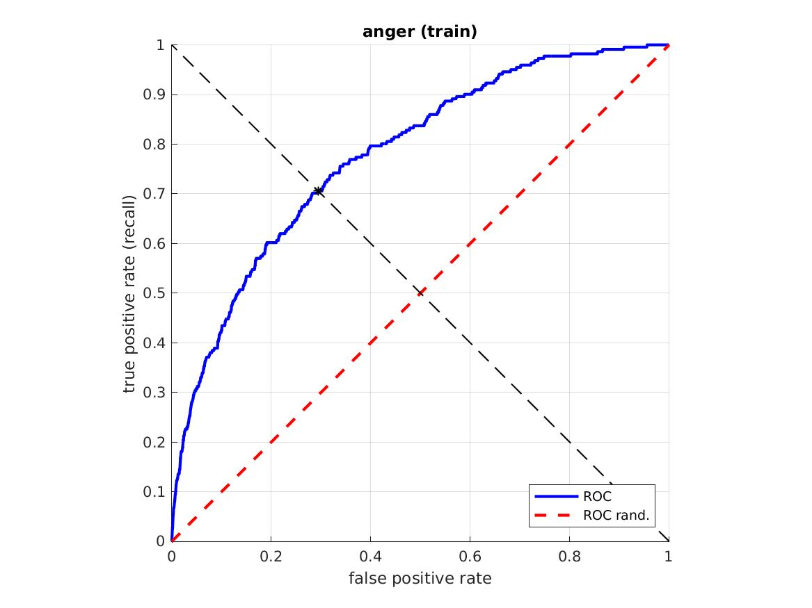 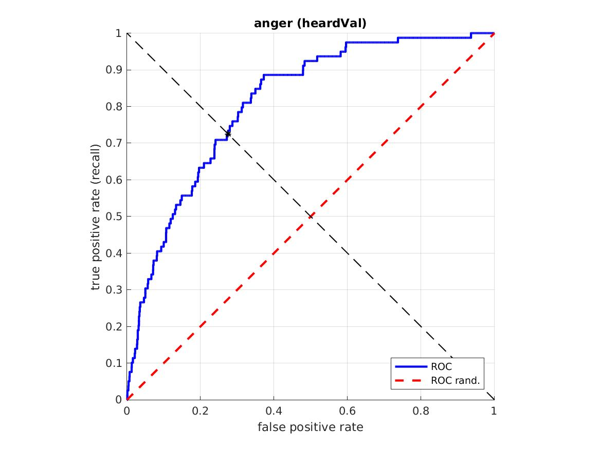 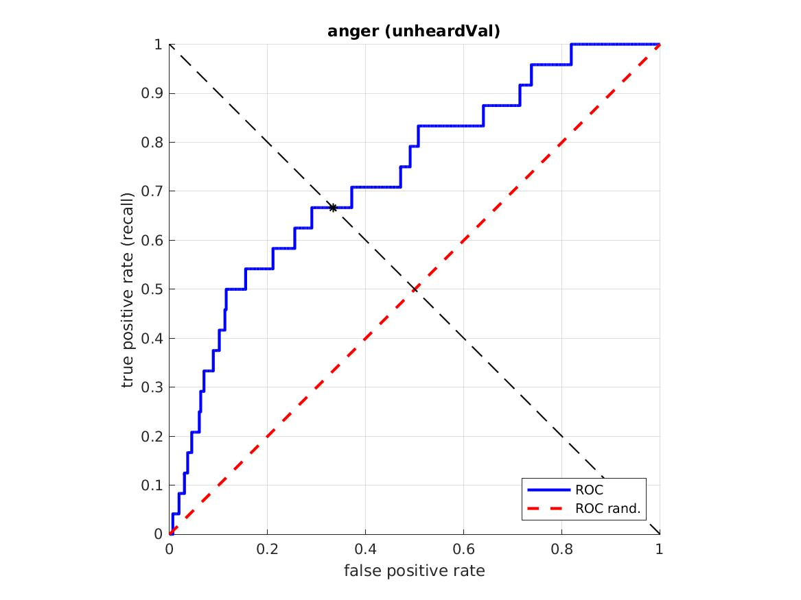

**Happiness**

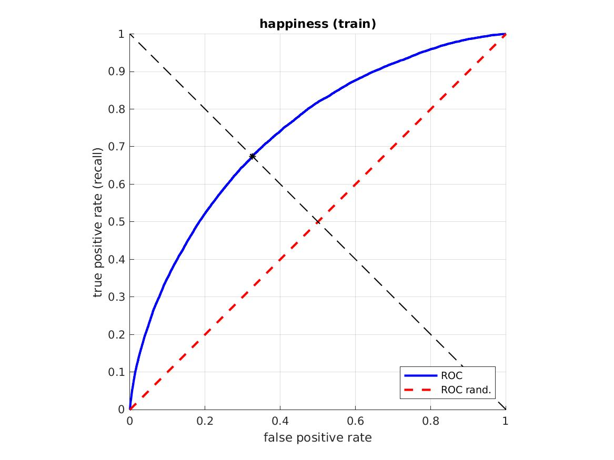 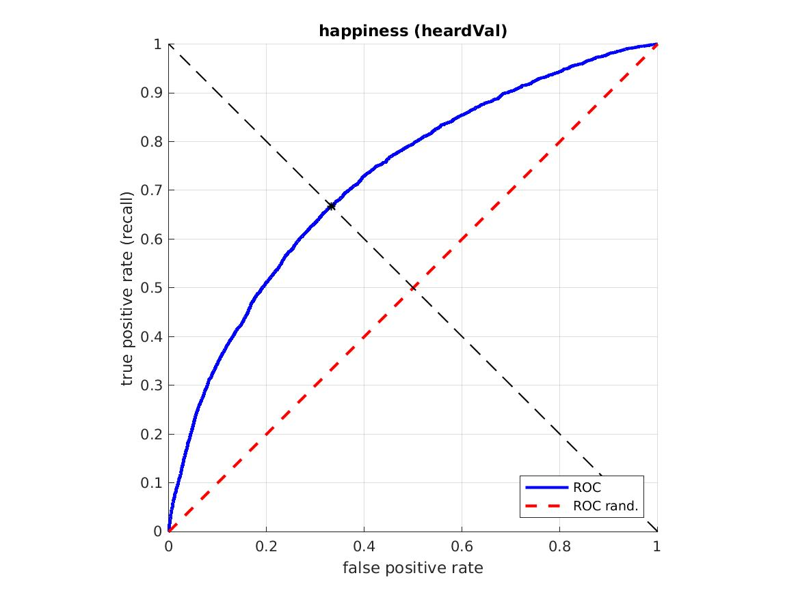 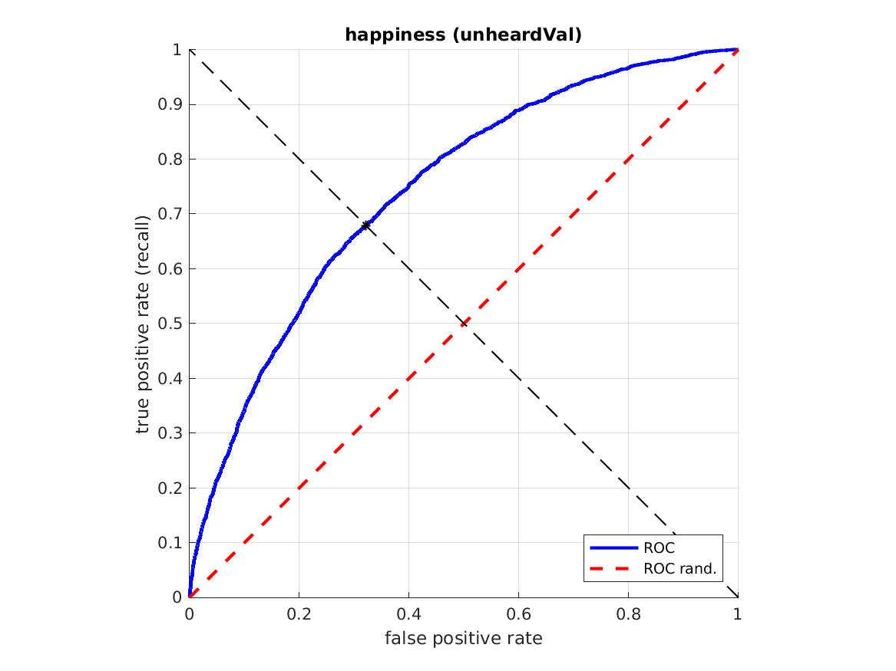

**Neutral**

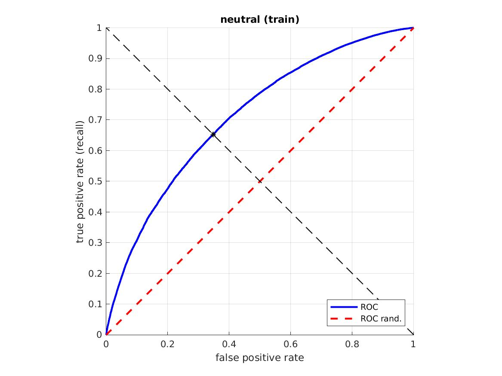 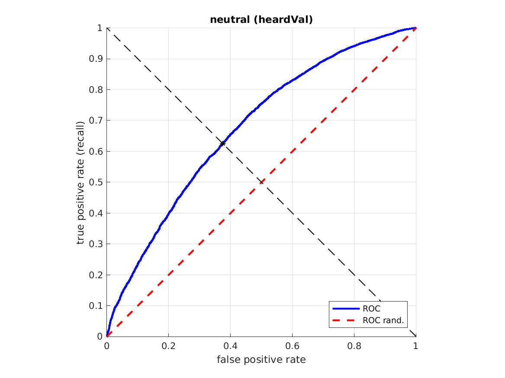 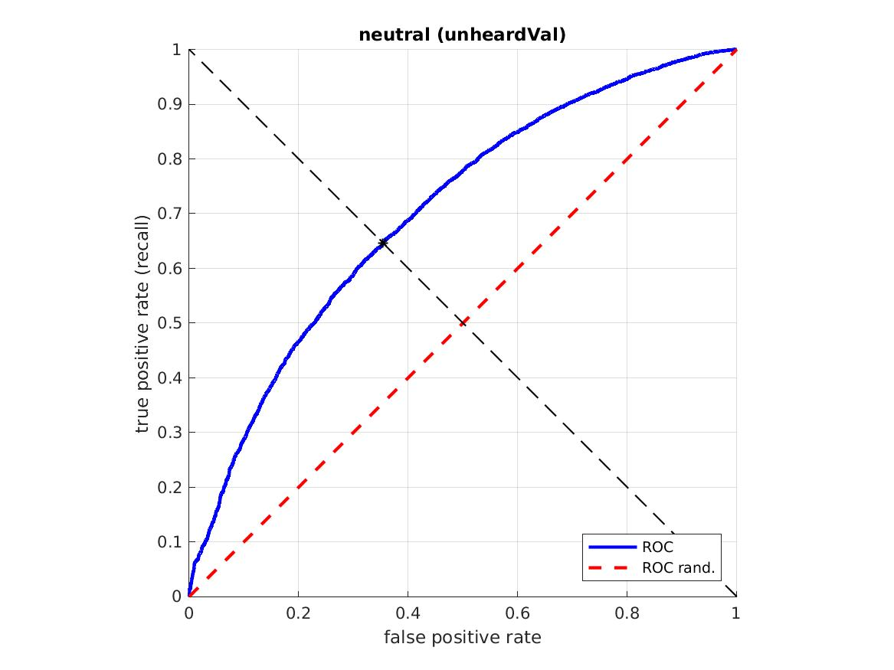

**Surprise**

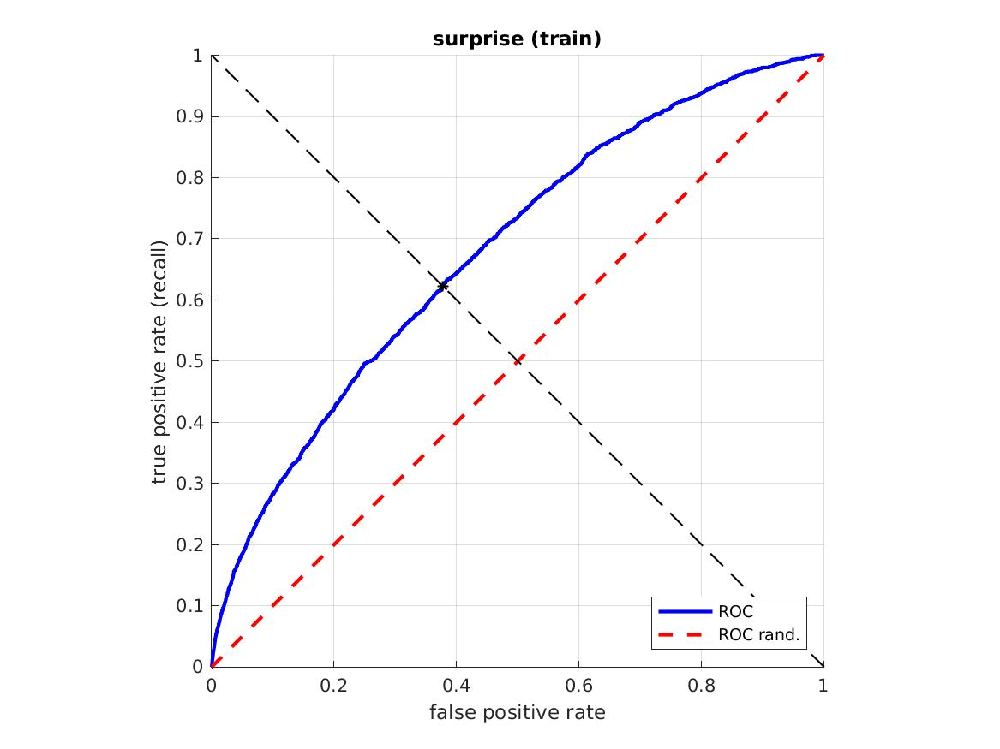  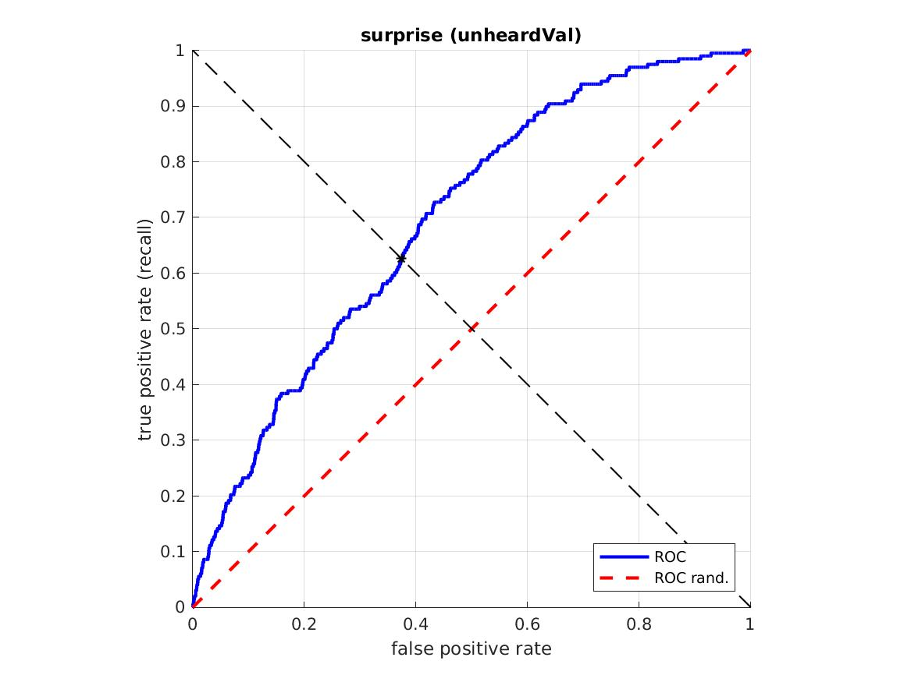

**Sadness**

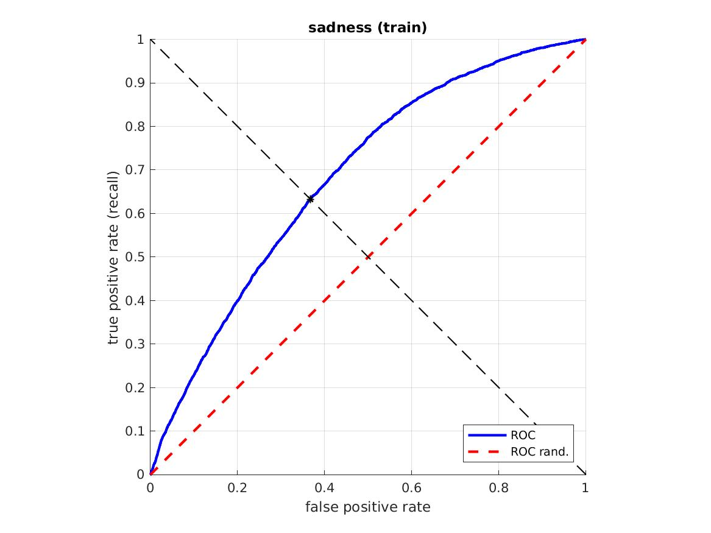 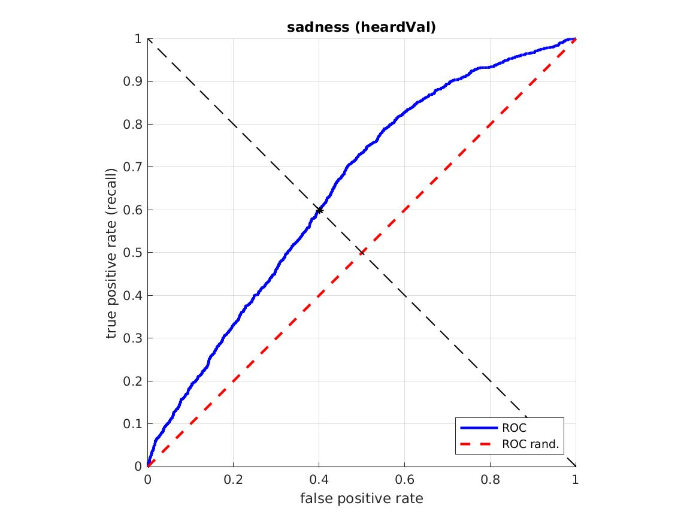 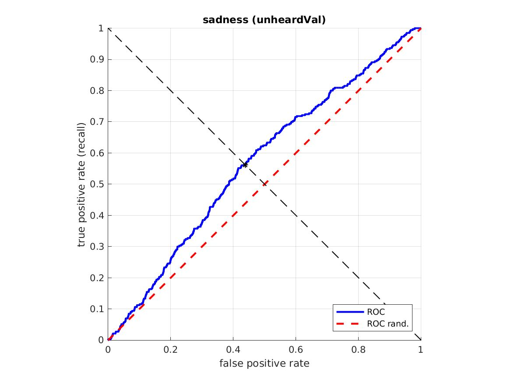


Note that since the dataset is highly unbalanced, some of the emotions have very few samples - the remaining emotions (fear, disgust and contempt) are rarely predicted as dominant by the teacher on the validation sets. 

### References

If you find the models or code useful, please consider citing:

```
@InProceedings{Albanie18a,
    title = "Emotion Recognition in Speech using Cross-Modal Transfer in the Wild",
    author = "Albanie, S. and Nagrani, A. and Vedaldi, A. and Zisserman, A.",     
    booktitle = "ACM Multimedia",
    year = "2018",
}
```

References for the related datasets are the FER2013+ dataset:

```
@inproceedings{BarsoumICMI2016,
    title={Training Deep Networks for Facial Expression Recognition with Crowd-Sourced Label Distribution},
    author={Barsoum, Emad and Zhang, Cha and Canton Ferrer, Cristian and Zhang, Zhengyou},
    booktitle={ACM International Conference on Multimodal Interaction (ICMI)},
    year={2016}
}
```

and the VoxCeleb dataset:

```
@article{nagrani2017voxceleb,
  title={Voxceleb: a large-scale speaker identification dataset},
  author={Nagrani, Arsha and Chung, Joon Son and Zisserman, Andrew},
  journal={arXiv preprint arXiv:1706.08612},
  year={2017}
}
```
